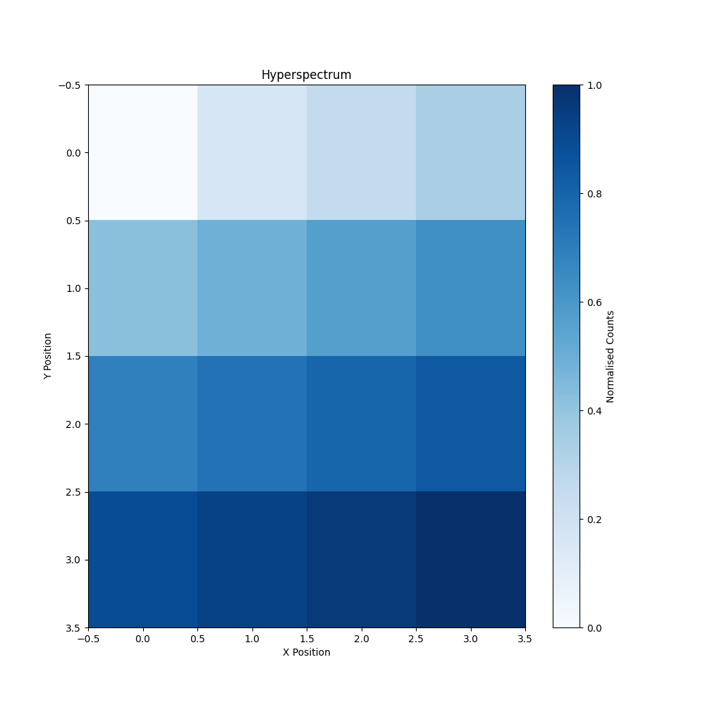

# SIF-Tools

SIF-Tools is a light-weight Python toolkit designed to read `.sif` data files from an Andor Solis spectrometer. This toolkit includes a set of utilities for opening, analyzing, and plotting data from `.sif` files, providing a convenient way to handle spectrometer data in scientific workflows.

This Toolkit borrows, and is adapted, from [sif_parser](https://github.com/fujiisoup/sif_parser) by [fujiisoup](https://github.com/fujiisoup). 

## Features

- **Read .sif files:** Efficiently load and parse `.sif` files from Andor Solis spectrometers.
- **Data manipulation:** Tools for handling and processing spectrometer data.
- **Visualization:** Plot data directly from `.sif` files.

## Requirements

- Python >= 3.6
- NumPy
- Matplotlib
- Scipy

## Installation

* Pip install
```bash
pip install sif-toolkit
```

* Clone the repository
```bash
git clone https://github.com/BjornFS/SIF-Toolkit.git
```

## Usage

### Importing SIF-Tools in a Python Script

Calling functions directly:

```python 
from sif_tools import sif2array

file = '/Users/user/location/file.sif'
data = sif2array(target=file, reduce_noise=False, window='narrow')
```

or 

```python 
from sif_tools import hyperspectrum

bg = 'test_background.sif'
directory = 'UnitTests/UnitTest files'

data = hyperspectrum(directory = directory, background = bg, size = (4,4), reduce_noise=True, window='pinched')
```

which produces the data structure to create:




See [examples](https://github.com/BjornFS/SIF-Tools/tree/main/examples) for more functions and usage.


## Support

If you encounter any issues or have questions, feel free to open an issue on the [GitHub repository](https://github.com/yourusername/SIF-Toolkit/issues).

## Contributing

We welcome contributions! Please fork the repository and submit pull requests.

## Authors

- Bjorn Schroder, Technical University of Denmark
- Bjornfschroder@gmail.com
